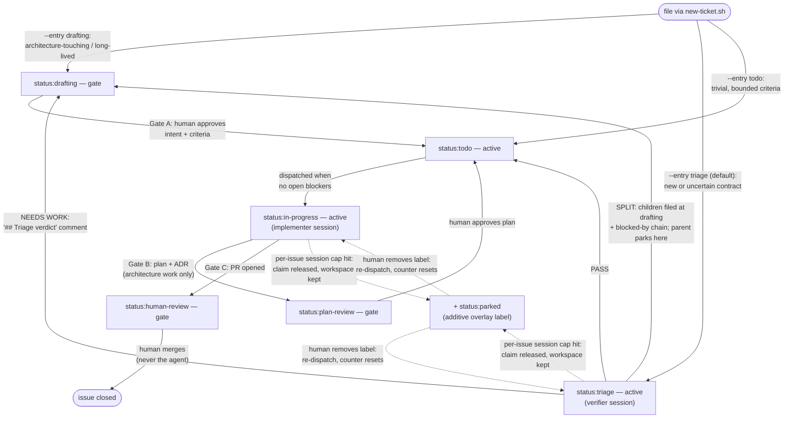

# Switchboard

Switchboard turns a GitHub issue board into a work queue for Claude agents.
You file tickets; an orchestrator dispatches each one to a fresh Claude session
in its own workspace; agents hand finished work back as PRs for a human to
merge. Humans own **intent** and **review**; the system owns **implementation**.

Concretely, it is three things:

- **One installed runtime** — a Symphony-derived orchestrator (vendored once,
  now owned — see [`spec/PROVENANCE.md`](spec/PROVENANCE.md)) plus a Claude
  execution adapter and a GitHub tracker adapter. Installed once, run as **one
  process per project**.
- **Per-project bindings** — a tiny `projects/<slug>/` directory (`project.env`
  + a composed `WORKFLOW.md`). Registering a project creates a binding, not a
  copy.
- **A methodology** — gate-state labels, ticket conventions, and review gates
  ([`methodology/METHODOLOGY.md`](methodology/METHODOLOGY.md)) that the
  orchestrator enforces for free by only dispatching *active* states.

**Setting up from scratch?** Follow [`SETUP.md`](SETUP.md) top to bottom and run
`bash scripts/verify-setup.sh` at any point to see which stage you're on. The
rest of this README assumes an installed runtime and covers day-to-day use.

---

## Quick start: onboard a project

You don't clone or fork this repo per project — you **register** an existing
repo:

```bash
# 1. Scaffold the binding + create the status labels on the repo's issue board.
scripts/register-project.sh --slug acme-api --repo acme/api --base main

# 2. Launch its orchestrator process (one per project; see deploy/ for systemd).
export SB_ORCHESTRATOR_CMD="uv run --project orchestrator python -m orchestrator"
scripts/run-project.sh acme-api

# 3. File a ticket. The orchestrator picks it up.
scripts/new-ticket.sh --scaffold > body.md   # edit the skeleton
scripts/new-ticket.sh --title "Fix retry backoff in sync worker" --body-file body.md
```

`scripts/list-projects.sh` shows what's registered. Prerequisites: `git`,
`bash`, `gh` (authed, with `gh auth setup-git`), the `claude` CLI, and `uv`.

What lives where: the runtime is **shared**; the `projects/<slug>/` binding is
**per-project**; each ticket gets a **fresh workspace** — a clean clone at
`<base>/<slug>/<issue-number>`, populated by `hooks/after_create.sh` (namespaced
per project because issue numbers collide across repos).

---

## The ticket lifecycle

Every ticket is a GitHub issue with exactly one `status:*` label. The label *is*
the state machine — the orchestrator dispatches **active** states and parks at
**gate** states, so every human gate costs zero orchestrator code:

| Label                 | Active? | Meaning                                                          |
|-----------------------|---------|------------------------------------------------------------------|
| `status:drafting`     | no      | Gate A pending — intent + spec being authored/approved            |
| `status:triage`       | **yes** | Adversarial ticket verification — dispatched to a verifier session |
| `status:todo`         | **yes** | Approved, unblocked, dispatchable                                 |
| `status:in-progress`  | **yes** | An agent is working it                                            |
| `status:plan-review`  | no      | Gate B handoff — plan/ADR awaiting human approval                 |
| `status:human-review` | no      | Gate C handoff — implementation done, awaiting human merge        |
| `status:blocked`      | no      | Parked (fallback when native dependencies aren't available)       |
| `status:parked`       | no      | Cap-park: halted at session cap — remove the label to re-dispatch |
| *(issue closed)*      | —       | Terminal                                                          |

Dependencies use GitHub's **native blocked-by** (`new-ticket.sh --blocked-by`);
a `status:todo` issue is never dispatched while a blocker is open.



Solid edges are the main pathway; dashed edges are the cap-park escape hatch
(`status:parked` is added *alongside* the current status, so unparking resumes
in the same role). Not shown: `status:blocked`, a manually-applied gate used
only as a fallback where native blocked-by is unavailable.

The three human gates:

- **Gate A** — intent/spec approved: a human moves `drafting → todo`.
- **Gate B** — plan approved: for architecture-touching work, the agent parks a
  plan + ADR at `plan-review`; a human approves before child tickets are filed.
- **Gate C** — final review: every implementation hands off at `human-review`.
  **Agents never self-merge.** Merge review includes ratifying any AgDRs the PR
  added — a PR that changed spec/methodology semantics without one is incomplete.

### Choosing the entry state (proportionality)

The path a ticket takes *is* the risk control — match it to the risk:

- **Trivial / low-risk** (one-line fix, typo, config bump) with already-bounded,
  checkable criteria → file straight at `--entry todo`. Forcing triage onto a
  five-minute bug is mis-set ceremony.
- **New, author-fresh, or uncertain** — criteria smell unbounded
  ("all/every/comprehensive"), assumptions unstated, size unclear → file at
  `--entry triage` (the default). A verifier session adversarially reviews the
  ticket and routes it: **PASS** → `todo`; **NEEDS WORK** → back to `drafting`
  with a `## Triage verdict` comment; **SPLIT** → child issues with blocked-by
  chaining. An unverified contract can burn a whole implementation session;
  triage is cheaper.
- **Architecture-touching / long-lived** → file at `--entry drafting`; it flows
  `drafting → todo → (plan-review) → human-review` and carries a
  `parent-intent: <slug>` pointer to a durable product-intent file.

### Ticket shape

`scripts/new-ticket.sh --scaffold` emits the template. For gated work the body
needs:

- **Intent** — one paragraph, what + why. State the problem, not the solution.
- **Acceptance criteria** — pass/fail checks, eval-shaped. These are the agent's
  definition of done.
- **Non-goals** — hard scope boundaries the agent must not cross.
- **Assumptions** — things taken as given; if one is false, the ticket is void.
- `parent-intent: <slug>` if it inherits a product-intent file.

Always file through `new-ticket.sh` — it encodes the template, entry-state
label, milestone attachment, and blocked-by chaining as one executable pathway,
so humans, assistant sessions, and the triage verifier's SPLIT verdict all file
the same shape. `--dry-run` prints the payload without touching the network.

---

## Graph review (manual, read-only analyzer)

`graph-review` reads the open board (bodies, comments, blocked-by edges,
milestones) plus recently merged PRs and writes evidence-cited proposals to one
rolling **Graph Review** issue: missing native edges, likely-wrong milestones,
merge/split candidates, assumptions a merged PR invalidated. Proposals only —
it never mutates other tickets, and there's no scheduler entry; you run it by
hand:

```bash
# Preview without writing to GitHub:
uv run --project orchestrator python -m orchestrator.graph_review \
  --workflow projects/switchboard-self/WORKFLOW.md --dry-run

# Write/refresh the rolling issue (idempotent; respects accepted/dismissed keys):
uv run --project orchestrator python -m orchestrator.graph_review \
  --workflow projects/switchboard-self/WORKFLOW.md
```

Structural proposals (merge/split/resequence) pass a skeptic refute sub-check
(`--refute-command`, default `claude -p`) before being written. Rationale:
`self/.decisions/AgDR-009-graph-review-phasing.md`.

---

## Layout

```
switchboard/
  spec/            # SPEC.md (owned bindings) + SPEC.core.md (vendored) + PROVENANCE.md
  orchestrator/    # Python/asyncio implementation: scheduler, Claude runner,
                   #   GitHub tracker, workspace mgr; pytest suite in tests/
  workflow/        # WORKFLOW.base.md — shared methodology base (defaults + prompt)
  methodology/     # METHODOLOGY.md — the IDSD workflow agents follow
  hooks/           # workspace population: after_create / before_run / after_run
  scripts/         # register-project, run-project, list-projects, new-ticket,
                   #   verify-setup
  deploy/          # optional systemd template (switchboard@.service)
  projects/<slug>/ # per-project binding (created by register-project.sh)
  self/            # dogfood scope: this repo managed as its own project
                   #   (.switchboard/intents/ + .decisions/ ADRs/AgDRs)
  handoff/         # port kits for re-implementing the methodology elsewhere
```

The product role (`spec/`, `workflow/`, `methodology/`, `hooks/`, `scripts/`)
is what registered projects consume — generic, no project-specific content. The
dogfood role lives entirely under `self/`; `methodology/` never references
`self/`. Register Switchboard as its own first project with
`scripts/register-project.sh --self --repo <you>/switchboard` to validate the
loop on the safest target (see `self/README.md`).

---

## Status & history

Phase 1 is complete: the orchestrator is implemented, tested, and dogfooding
this repo as its own project (`projects/switchboard-self/`). The full loop —
register, file a ticket, triage verification, worker dispatch, PR handoff at
the human gate — runs today. The decision-corpus MCP is a later phase.

The legacy Switchboard framework (lanes, Jam, tier-pinned pools) is preserved
in git only — tag `switchboard-legacy-archive` and the `archive/*` branches.
Nothing in the working tree imports from it.

See [`spec/SPEC.md`](spec/SPEC.md) for the bindings and
[`methodology/METHODOLOGY.md`](methodology/METHODOLOGY.md) for the full
gate-state workflow.
