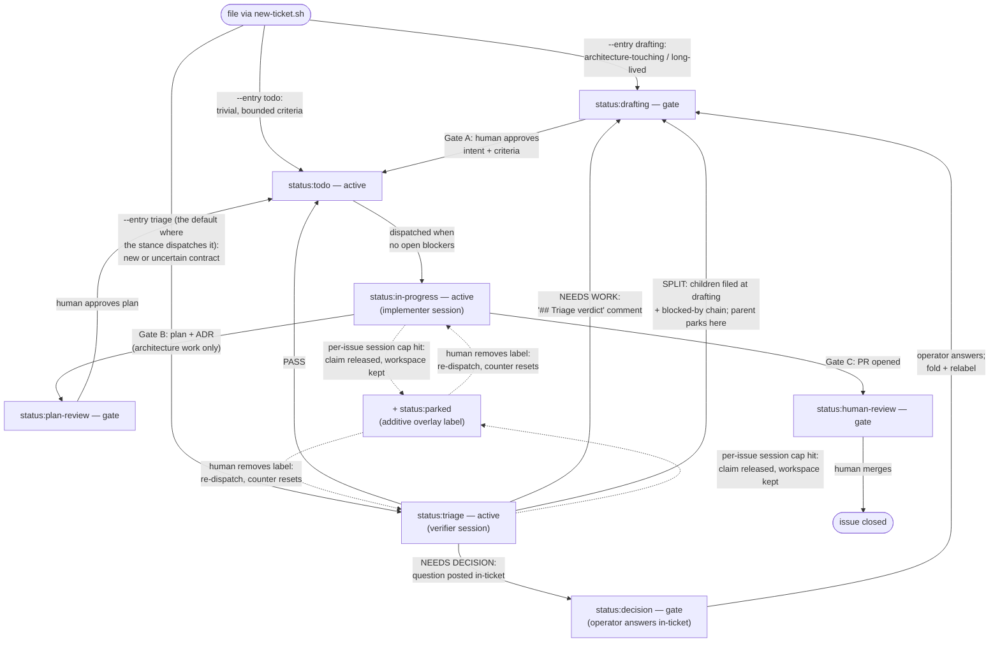

# Switchboard

Switchboard turns a GitHub issue board into a work queue for Claude agents.
You file tickets; an orchestrator dispatches each one to a fresh Claude session
in its own workspace; agents hand finished work back as PRs.

**Humans always own intent. Who owns *review* is the project's choice** — that
is what a stance is (AgDR-039/AgDR-043). At `base`, every PR is handed to a human
to merge. At `prototype` — the `register-project.sh` default — Gate C goes to an
agent reviewer that may merge on a SHIP verdict. It escalates to a human on three
conditions: content on its escalation list, a finding that survives two rounds,
or — where a cross-model review bot is configured — that bot's review being
absent, stale, or pending for the current head sha (it fails closed). Pick
deliberately; `SETUP.md` has the stance table, and
`--self` defaults to `base` for exactly this reason (#153).

Concretely, it is three things:

- **One installed runtime** — a Symphony-derived orchestrator (vendored once,
  now owned — see [`spec/PROVENANCE.md`](spec/PROVENANCE.md)) plus a Claude
  execution adapter and a GitHub tracker adapter. Installed once, run as **one
  process per project**.
- **Per-project bindings** — a tiny `projects/<slug>/` directory (`project.env`
  + a composed `WORKFLOW.md`). Registering a project creates a binding, not a
  copy.
- **A methodology** — gate-state labels, ticket conventions, and review gates
  ([`methodology/METHODOLOGY.md`](methodology/METHODOLOGY.md)) that the
  orchestrator enforces for free by only dispatching *active* states.

**Setting up from scratch?** Follow [`SETUP.md`](SETUP.md) top to bottom and run
`bash scripts/verify-setup.sh` at any point to see which stage you're on. The
rest of this README assumes an installed runtime and covers day-to-day use.

---

## Quick start: onboard a project

You don't clone or fork this repo per project — you **register** an existing
repo:

```bash
# 1. Scaffold the binding + create the status labels on the repo's issue board.
scripts/register-project.sh --slug acme-api --repo acme/api --base main

# 2. Launch its orchestrator process (one per project). This runs in the
#    foreground and dies with the terminal — to leave it running unattended,
#    supervise it: SETUP.md "Stage 5b — macOS supervision (launchd)", or
#    deploy/switchboard@.service on Linux.
export SB_ORCHESTRATOR_CMD="uv run --project orchestrator python -m orchestrator"
scripts/run-project.sh acme-api

# 3. File a ticket against the project's repo. The orchestrator picks it up.
#    (--repo is required here: without it new-ticket.sh falls back to
#    SB_GITHUB_REPO or the current checkout's git remote — i.e. Switchboard
#    itself. Alternatively, source projects/acme-api/project.env first.)
#
#    The entry state is resolved from the project's stance — omit --entry and
#    you get a state that project actually dispatches, or a refusal naming the
#    ones it does. Pass --entry to override.
scripts/new-ticket.sh --scaffold > body.md   # edit the skeleton
scripts/new-ticket.sh --repo acme/api \
  --title "Fix retry backoff in sync worker" --body-file body.md
```

`scripts/list-projects.sh` shows what's registered. Prerequisites: `git`,
`bash`, `gh` (authed, with `gh auth setup-git`), the `claude` CLI, and `uv`.

What lives where: the runtime is **shared**; the `projects/<slug>/` binding is
**per-project**; each ticket gets a **fresh workspace** — a clean clone at
`<base>/<slug>/<issue-number>`, populated by `hooks/after_create.sh` (namespaced
per project because issue numbers collide across repos).

---

## The ticket lifecycle

Every ticket is a GitHub issue with exactly one `status:*` label. The label *is*
the state machine — the orchestrator dispatches **active** states and parks at
**gate** states, so every human gate costs zero orchestrator code:

| Label                 | Active? | Meaning                                                          |
|-----------------------|---------|------------------------------------------------------------------|
| `status:drafting`     | no      | Gate A pending — intent + spec being authored/approved            |
| `status:triage`       | *stance*| Adversarial ticket verification — dispatched to a verifier session; active at `base`, absent from `prototype` |
| `status:todo`         | **yes** | Approved, unblocked, dispatchable                                 |
| `status:in-progress`  | **yes** | An agent is working it                                            |
| `status:decision`     | no      | Waiting-on-operator gate — triage found an unmade human decision; reply with your choice, fold it, relabel to drafting |
| `status:plan-review`  | no      | Gate B handoff — plan/ADR awaiting human approval                 |
| `status:review`       | *stance*| Gate C handoff to an **agent** reviewer — active at `prototype`, absent from `base` |
| `status:human-review` | no      | Gate C handoff to a **human** — awaiting human merge              |
| `status:blocked`      | no      | Parked (fallback when native dependencies aren't available)       |
| `status:parked`       | no      | Cap-park: halted at session cap — remove the label to re-dispatch |
| *(issue closed)*      | —       | Terminal                                                          |

Dependencies use GitHub's **native blocked-by** (`new-ticket.sh --blocked-by`);
a `status:todo` issue is never dispatched while a blocker is open.


```mermaid
flowchart TD
    new(["file via new-ticket.sh"])

    drafting["status:drafting — gate"]
    triage["status:triage — active<br/>(verifier session)"]
    decision["status:decision — gate<br/>(operator answers in-ticket)"]
    todo["status:todo — active"]
    inprog["status:in-progress — active<br/>(implementer session)"]
    planrev["status:plan-review — gate"]
    humrev["status:human-review — gate"]
    closed(["issue closed"])
    parked["+ status:parked<br/>(additive overlay label)"]

    new -->|"--entry drafting:<br/>architecture-touching / long-lived"| drafting
    new -->|"--entry triage (the default where<br/>the stance dispatches it):<br/>new or uncertain contract"| triage
    new -->|"--entry todo:<br/>trivial, bounded criteria"| todo

    drafting -->|"Gate A: human approves<br/>intent + criteria"| todo
    triage -->|"PASS"| todo
    triage -->|"NEEDS WORK:<br/>'## Triage verdict' comment"| drafting
    triage -->|"SPLIT: children filed at drafting<br/>+ blocked-by chain; parent parks here"| drafting
    triage -->|"NEEDS DECISION:<br/>question posted in-ticket"| decision
    decision -->|"operator answers;<br/>fold + relabel"| drafting
    todo -->|"dispatched when<br/>no open blockers"| inprog
    inprog -->|"Gate B: plan + ADR<br/>(architecture work only)"| planrev
    planrev -->|"human approves plan"| todo
    inprog -->|"Gate C: PR opened"| humrev
    humrev -->|"human merges"| closed

    triage & inprog -.->|"per-issue session cap hit:<br/>claim released, workspace kept"| parked
    parked -.->|"human removes label:<br/>re-dispatch, counter resets"| triage & inprog
```

**The diagram is the `base` pipeline.** Which states are active is the stance's
choice, so a project on another stance walks a different path through the same
labels — `prototype` has no `triage` step and routes Gate C to `status:review`
(an agent reviewer) rather than `status:human-review`. See the stance table in
`SETUP.md` before reading this as universal.

Solid edges are the main pathway; dashed edges are the cap-park escape hatch
(`status:parked` is added *alongside* the current status, so unparking resumes
in the same role). Not shown: `status:blocked`, a manually-applied gate used
only as a fallback where native blocked-by is unavailable.

The three human gates:

- **Gate A** — intent/spec approved: a human moves `drafting → todo`.
- **Gate B** — plan approved: for architecture-touching work, the agent parks a
  plan + ADR at `plan-review`; a human approves before child tickets are filed.
- **Gate C** — final review: **nothing merges unreviewed.** *Who* reviews is the
  project's stance — a gated stance parks at `human-review` for a human, an
  autonomous one hands off to a QA state it dispatches and lets a reviewer
  session merge inside a bounded escalation list. Merge review, by whoever
  performs it, includes ratifying any AgDRs the PR added — a PR that changed
  spec/methodology semantics without one is incomplete.

### Worker handoff evidence

Workers hand completed work back by writing `.run/handoff-evidence.json` with
the issue number (`issue`), pull request number (`pr_number`), and committed
branch head (`head_sha`). Writing this file is the worker's **final action**;
workers do not change `status:*` labels themselves.

After the worker turn succeeds, the orchestrator validates that the evidence is
fresh, the worktree is clean, and exactly one open PR exists on the issue branch.
That PR must link to and close the issue, and its head must match both `head_sha`
and the workspace HEAD. Only then does the orchestrator perform the single
handoff transition — to the stance's `tracker.handoff_label`, which is
`status:human-review` by default and `status:review` at `prototype`
(AgDR-039/AgDR-043), not a constant. Invalid or stale evidence produces a
diagnostic and no transition. See
[`AgDR-028`](self/.decisions/AgDR-028-orchestrator-owned-terminal-handoff.md) for
the complete contract and rationale.

### Choosing the entry state (proportionality)

Entry states are only meaningful where the stance dispatches them, so
`new-ticket.sh` reads the target project's `active_states` rather than carrying a
fixed default: it picks `triage` where the project verifies tickets before
dispatch, `todo` where it does not, and refuses — naming the states the project
*does* dispatch — where it cannot tell. An explicit `--entry` naming a state the
project neither dispatches nor gates is refused the same way. At `prototype` the
choice below therefore collapses to `todo` on its own; the list is the `base`
menu (`AgDR-049`).

At `base`, the path a ticket takes *is* the risk control — match it to the risk:

- **Trivial / low-risk** (one-line fix, typo, config bump) with already-bounded,
  checkable criteria → file straight at `--entry todo`. Forcing triage onto a
  five-minute bug is mis-set ceremony. (`new-ticket.sh` stamps
  `gate:triage-passed` on this path — the human filing it is the out-of-band
  verification; an unstamped `status:todo` is refused by the dispatch guard.)
- **New, author-fresh, or uncertain** — criteria smell unbounded
  ("all/every/comprehensive"), assumptions unstated, size unclear → file at
  `--entry triage` (what the default resolves to at `base`). A verifier session
  adversarially reviews the
  ticket and routes it: **PASS** → `todo`; **NEEDS WORK** → back to `drafting`
  with a `## Triage verdict` comment; **SPLIT** → child issues with blocked-by
  chaining. An unverified contract can burn a whole implementation session;
  triage is cheaper.
- **Architecture-touching / long-lived** → file at `--entry drafting`; it flows
  `drafting → todo → (plan-review) → human-review` and carries a
  `parent-intent: <slug>` pointer to a durable product-intent file.

### Ticket shape

`scripts/new-ticket.sh --scaffold` emits the template. For gated work the body
needs:

- **`## In brief`** — a two-field plain-language summary (what this does, what
  could be wrong), first section, above the rest.
- **Intent** — one paragraph, what + why. State the problem, not the solution.
- **Acceptance criteria** — pass/fail checks, eval-shaped. These are the agent's
  definition of done.
- **Non-goals** — hard scope boundaries the agent must not cross.
- **Assumptions** — things taken as given; if one is false, the ticket is void.
- `parent-intent: <slug>` if it inherits a product-intent file.

Always file through `new-ticket.sh` — it encodes the template, entry-state
label, milestone attachment, and blocked-by chaining as one executable pathway,
so humans, assistant sessions, and the triage verifier's SPLIT verdict all file
the same shape. `--dry-run` prints the payload without touching the network.

---

## Graph review (manual, read-only analyzer)

`graph-review` reads the open board (bodies, comments, blocked-by edges,
milestones) plus recently merged PRs and writes evidence-cited proposals to one
rolling **Graph Review** issue: missing native edges, likely-wrong milestones,
merge/split candidates, assumptions a merged PR invalidated. Proposals only —
it never mutates other tickets, and there's no scheduler entry; you run it by
hand:

```bash
# Preview without writing to GitHub:
uv run --project orchestrator python -m orchestrator.graph_review \
  --workflow projects/switchboard-self/WORKFLOW.md --dry-run

# Write/refresh the rolling issue (idempotent; respects accepted/dismissed keys):
uv run --project orchestrator python -m orchestrator.graph_review \
  --workflow projects/switchboard-self/WORKFLOW.md
```

Structural proposals (merge/split/resequence) pass a skeptic refute sub-check
(`--refute-command`, default `claude -p`) before being written. Rationale:
`self/.decisions/AgDR-012-graph-review-phasing.md`.

---

## Verify the orchestrator

After installing (or before touching orchestrator code), run the full test
suite from the repository root:

```bash
uv run --project orchestrator python -m pytest orchestrator/tests -q
```

Pass the explicit `orchestrator/tests` path rather than a bare `pytest`. The
path makes pytest discover `orchestrator/pyproject.toml` — including its
`asyncio_mode = "auto"` configuration — instead of the repository root, where
the async tests would fail to collect. This is the same command `SETUP.md` uses
to verify a fresh install.

---

## Codex provider support (adapter present, no canary running)

The normal process is Claude-only. A Codex CLI adapter, a mixed-provider routing
selector, and a provider circuit breaker are all present and covered by
`test_codex_runner.py`, `test_runner_selector.py`, and `test_provider_circuit.py`.
Opt in at process start:

```bash
codex login status
uv run --project orchestrator python -m orchestrator \
  --workflow projects/<isolated-project>/WORKFLOW.md --provider codex
```

Codex mode rejects legacy execution blocks and mixed `providers` maps; without
`--provider codex`, startup validates and selects Claude. Use it only against a
separate repository.

**The `codex-canary` and `mixed-canary` project bindings were retired on
2026-08-15.** They were rollout scaffolding for prepping the mixed environment,
dormant since mid-July, and still being hand-maintained through every change to
the binding format. The capability they were staging is in the adapter and its
tests; what retired was the choreography, not the feature. Their decision
records (`AgDR-016`, `AgDR-019` through `AgDR-026`) remain as history.

One residual worth knowing: `orchestrator/src/orchestrator/codex_runner.py` has
**no PreToolUse surface**, so the merge guard (`AgDR-036`/`AgDR-043`) does not
apply to Codex sessions at all. That is issue **#135**, and it is the thing to
close before routing any real work to Codex.

---

## Layout

```
switchboard/
  spec/            # SPEC.md (owned bindings) + SPEC.core.md (vendored) + PROVENANCE.md
  orchestrator/    # Python/asyncio implementation: scheduler, CLI runners,
                   #   GitHub tracker, workspace mgr; pytest suite in tests/
  workflow/        # WORKFLOW.base.md — shared methodology base (defaults + prompt)
  methodology/     # METHODOLOGY.md — the IDSD workflow agents follow
  hooks/           # workspace population: after_create / before_run / after_run
  scripts/         # register-project, run-project, list-projects, new-ticket,
                   #   verify-setup
  deploy/          # optional supervision templates: switchboard@.service
                   #   (systemd) + com.switchboard.__SLUG__.plist.template (launchd)
  projects/<slug>/ # per-project binding (created by register-project.sh)
  self/            # dogfood scope: this repo managed as its own project
                   #   (.switchboard/intents/ + .decisions/ ADRs/AgDRs)
  handoff/         # port kits for re-implementing the methodology elsewhere
```

The product role (`spec/`, `workflow/`, `methodology/`, `hooks/`, `scripts/`)
is what registered projects consume — generic, no project-specific content. The
dogfood role lives entirely under `self/`; `methodology/` never references
`self/`. Register Switchboard as its own first project with
`scripts/register-project.sh --self --repo <you>/switchboard` to validate the
loop on the safest target (see `self/README.md`).

---

## Status & history

Phase 1 is complete: the orchestrator is implemented, tested, and dogfooding
this repo as its own project (`projects/switchboard-self/`). The full loop —
register, file a ticket, triage verification, worker dispatch, PR handoff at
the human gate — runs today. The decision-corpus MCP is a later phase.

The legacy Switchboard framework (lanes, Jam, tier-pinned pools) is preserved
in git only — tag `switchboard-legacy-archive` and the `archive/*` branches.
Nothing in the working tree imports from it.

See [`spec/SPEC.md`](spec/SPEC.md) for the bindings and
[`methodology/METHODOLOGY.md`](methodology/METHODOLOGY.md) for the full
gate-state workflow.
